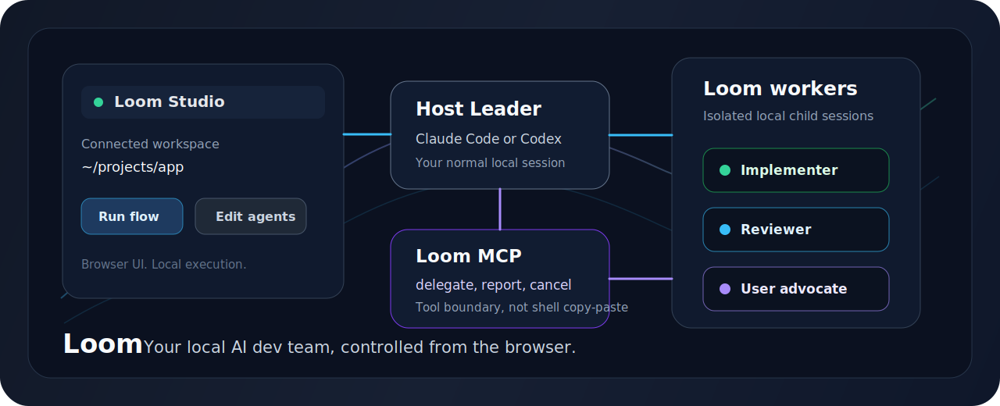
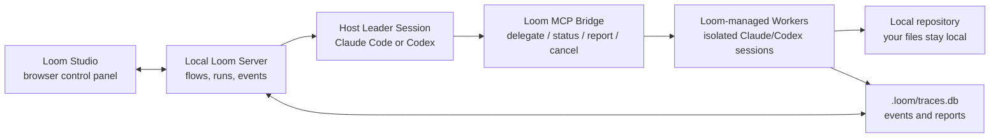

# Loom

<p align="center">
  
</p>

<p align="center">
  <strong>Your local AI dev team, controlled from the browser.</strong>
</p>

<p align="center">
  <a href="https://aproto9787.github.io/loom/"></a>
  <a href="LICENSE"></a>
  
  
  
  
</p>

Loom is a local control plane for Claude Code, Codex, MCP tools, and repository workflows.

It starts from a simple idea: keep your existing coding agents local, then give them a browser workspace, a team structure, scoped worker sessions, and a traceable delegation layer.

```text
Start Loom locally
  -> choose a YAML flow
  -> Loom injects run-scoped MCP delegation tools
  -> your host Claude Code or Codex session leads the work
  -> isolated Loom workers handle delegated tasks
  -> Studio shows reports, events, and run history
```

Loom is not a cloud runtime and it is not a blank node-graph builder. The current implementation is a local recursive agent harness with a Studio UI and MCP-first delegation.

> [!IMPORTANT]
> This repository moves quickly. This README describes the current `master` branch and avoids claims that are not represented in the TypeScript schema or runtime. The product direction lives in [`docs/LOCAL_AGENT_CONTROL_PLANE.md`](docs/LOCAL_AGENT_CONTROL_PLANE.md), and the code-backed status checklist lives in [`docs/CURRENT_STATE.md`](docs/CURRENT_STATE.md).

## What Loom Gives You

| Surface | What it does |
| --- | --- |
| `loom` | Starts a host leader session from a selected flow and injects Loom MCP delegation tools. |
| `loom mcp` | Runs the stdio MCP bridge that exposes child-agent delegation tools. |
| `loom-subagent` | Internal child-agent launcher behind MCP delegation. |
| Studio | Browser UI for editing flows, roles, hooks, skills, and watching runs. |
| Server | Local Fastify API for flow CRUD, run history, events, discovery, and SSE. |
| YAML flows | Source-controlled agent teams with host leaders and isolated workers. |

## Why It Exists

Most coding-agent setups hit the same wall:

- Claude Code and Codex are useful, but they live as separate local sessions.
- MCP servers, hooks, roles, and repo conventions are scattered across config files.
- Delegation is usually prompt text, shell copy-paste, or invisible sub-sessions.
- Browser UX is convenient, but developers still want code execution to stay local.

Loom stitches those pieces into one local workspace:

- Host leader session: your normal local Claude Code or Codex profile.
- Loom overlay: flow instructions, child-agent list, delegation rules, and reporting protocol.
- MCP delegation: typed tools such as `loom_delegate_reviewer` and `loom_delegate_many`.
- Isolated workers: scoped HOME/config, scoped resources, mandatory REPORT output.
- Trace layer: events and reports persisted under `.loom/traces.db`.

## Runtime Model



The split is intentional:

```text
Leader comes from your local provider.
Workers are managed by Loom.
MCP connects them with a traceable delegation boundary.
```

## Current Highlights

- Recursive agent-tree flow schema with `claude-code` and `codex` agent types.
- Host/isolated runtime metadata with MCP-only delegation transport.
- Provider profile discovery for local Claude Code and Codex installs.
- Run-scoped MCP config injection for host leader sessions.
- Dynamic MCP tools for enabled direct children, including `loom_delegate_<agent>`.
- `loom_delegate_many` for parallel worker dispatch from a single tool call.
- SQLite-backed run and event persistence under `.loom/traces.db`.
- Studio UI for flows, roles, hooks, skills, resources, and run detail views.
- Default `leader-workers` flow with implementers, analysts, reviewer, fixer, debaters, synthesizer, and user-advocate.
- Phase-gated workflow policy: phase work can require `user-advocate` PASS before moving forward.
- Debate routing policy: casual `debate`, `vs`, comparison, recommendation, or decision prompts can route through debater agents.

## Quickstart From Source

Loom currently runs from a built checkout. Published `npx loom` / global install guarantees are not claimed yet.

Requirements:

- Node.js `>=22.13.0`
- pnpm `10.x`
- Local Claude Code and/or Codex if you want real provider-backed runs

```bash
pnpm install
pnpm -r build
```

Run the local server and Studio:

```bash
pnpm --filter @loom/server dev
pnpm --filter @loom/studio dev
```

Defaults:

- Server: `http://localhost:8787`
- Studio: `http://localhost:5173`

Or start all dev processes through the workspace script:

```bash
pnpm dev
```

## Run a Flow

Build the CLI, then start Loom in any repository:

```bash
pnpm --filter loom build
node packages/cli/dist/index.js
```

The CLI scans the current directory and `examples/` for `.yaml` flows, lets you pick one, then launches the selected flow's root leader.

Headless run:

```bash
node packages/cli/dist/index.js \
  --flow examples/leader-workers.yaml \
  --prompt "Review this workspace and delegate as needed." \
  --headless
```

Start only the MCP bridge:

```bash
node packages/cli/dist/index.js mcp
```

The MCP bridge is normally launched by a host leader through a temporary run-scoped config generated by `loom`.

## Example Flow

```yaml
version: "1"
name: Review Flow
repo: .

orchestrator:
  name: leader
  type: codex
  runtime:
    mode: host
    profile: codex-default
    applyResources: prompt-only
    delegationTransport: mcp
  system: |
    Plan the work, delegate concrete tasks, read child reports, and make the
    final decision.
  delegation:
    - to: reviewer
      when: Code or documentation needs a second pass.
  agents:
    - name: reviewer
      type: codex
      role: code-reviewer
      runtime:
        mode: isolated
        profile: codex-default
        applyResources: scoped-home
      system: |
        Review the assigned work and report concrete findings.
```

The active example set is under [`examples/`](examples/). The default Studio/server path centers on [`examples/leader-workers.yaml`](examples/leader-workers.yaml).

## Studio

Studio is a browser control surface for the local server:

- inspect and edit recursive flow trees
- configure agent roles, models, prompts, MCPs, hooks, and skills
- run selected flows against the local workspace
- stream run events and inspect worker reports
- keep YAML as the source of truth for Git review

Studio is intentionally a control panel over local execution. It does not move repository execution into a remote cloud runtime.

## Resource Model

Loom has three source-controlled workspace resource directories:

```text
roles/*.yaml
hooks/*.yaml
skills/*.yaml
```

Resource behavior today:

- Roles provide defaults for type, model, system prompt, effort, description, and MCPs.
- Skills append prompt text.
- Hooks run local shell commands through the server runner.
- MCP names are resolved from user/workspace MCP config and written into temporary scoped config for a run.
- Host leaders use prompt-only flow overlays.
- Workers can receive scoped resources inside isolated HOME/config directories.

## Repository Map

```text
loom/
├── apps/
│   ├── server/       Fastify API, flow validation, local CLI runs, traces
│   └── studio/       React + Vite browser control panel
├── packages/
│   ├── core/         Zod schemas and shared flow/run types
│   ├── cli/          loom and loom-subagent binaries
│   ├── mcp/          stdio MCP delegation bridge
│   └── runtime/      flow loading, resources, prompts, hooks, reports
├── examples/         YAML flows shown by server and Studio
├── roles/            reusable role definitions
├── hooks/            local hook definitions
├── skills/           prompt skill definitions
└── docs/             architecture, current state, implementation notes
```

## API Surface

The local server exposes routes for:

- health: `GET /health`
- flows: `GET /flows`, `GET /flows/get`, `PUT /flows/save`, `POST /flows/new`, `POST /flows/duplicate`, `DELETE /flows/:path`
- runs: `POST /runs`, `GET /runs`, `GET /runs/:id`, `POST /runs/:id/abort`
- events: `POST /runs/register`, `POST /runs/:id/events`, `GET /runs/:id/events`, `GET /runs/:id/stream`, `PATCH /runs/:id/status`
- resources: `GET /roles`, `GET /hooks`, `GET /skills`, plus save/delete endpoints
- discovery: `GET /mcps`, `GET /discover`

Flow paths accepted by server run/save/get routes must stay under `examples/` and end in `.yaml`.

## What Loom Is Not Yet

These are not implemented as shipped runtime guarantees today:

- visual DAG execution with typed edges
- routers, loop/join nodes, or graph-cost meters
- global `npx loom` quickstart
- published package install path
- automated golden-path coverage for full leader-to-worker recursion
- cloud-hosted code execution

If you need the current baseline before changing docs, read [`docs/CURRENT_STATE.md`](docs/CURRENT_STATE.md).

## Safety Notes

> [!WARNING]
> Loom can run local CLI tools and shell hooks. Treat flows, roles, hooks, skills, and MCP configs as trusted code/configuration.

Current code paths include powerful execution modes:

- Claude Code adapter uses `--permission-mode bypassPermissions`.
- Codex adapter uses `--dangerously-bypass-approvals-and-sandbox`.
- CLI launch uses dangerous permission/sandbox bypass flags for root agents.
- Hooks run shell commands through `child_process.exec`.

Use Loom only inside repositories and workspaces you trust.

## Docs

- [`docs/LOCAL_AGENT_CONTROL_PLANE.md`](docs/LOCAL_AGENT_CONTROL_PLANE.md): target product and runtime contract
- [`docs/CURRENT_STATE.md`](docs/CURRENT_STATE.md): code-backed implementation status
- [`docs/ARCHITECTURE.md`](docs/ARCHITECTURE.md): system architecture
- [`docs/PROGRESS.md`](docs/PROGRESS.md): project history and progress notes

## License

Copyright (C) 2026 aproto9787

Loom is free software: you can redistribute it and/or modify it under the terms of the GNU General Public License as published by the Free Software Foundation, version 3.

Loom is distributed in the hope that it will be useful, but WITHOUT ANY WARRANTY; without even the implied warranty of MERCHANTABILITY or FITNESS FOR A PARTICULAR PURPOSE. See the [LICENSE](LICENSE) file for the full terms.
